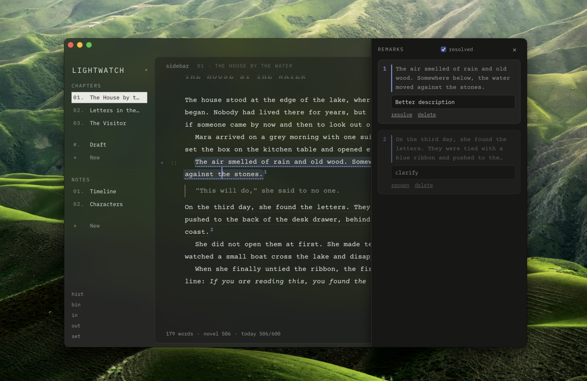
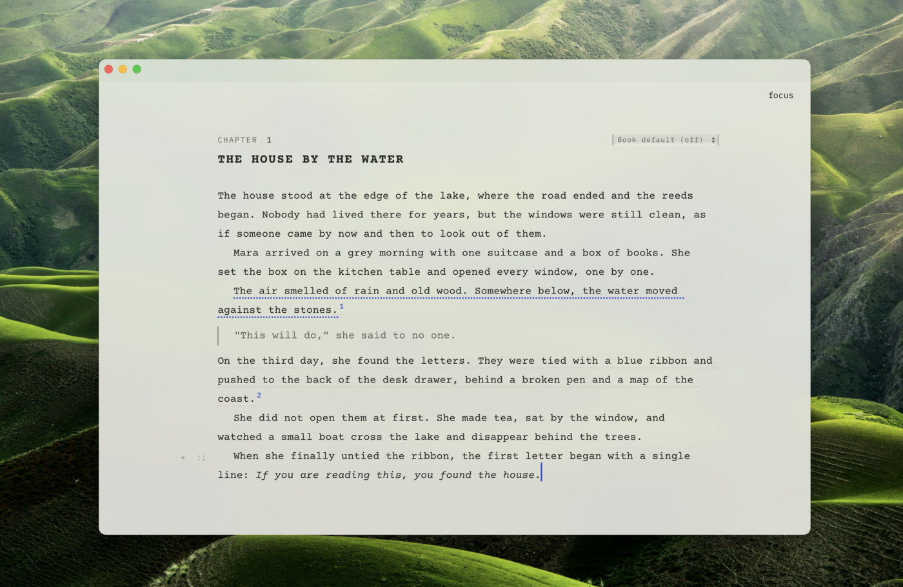
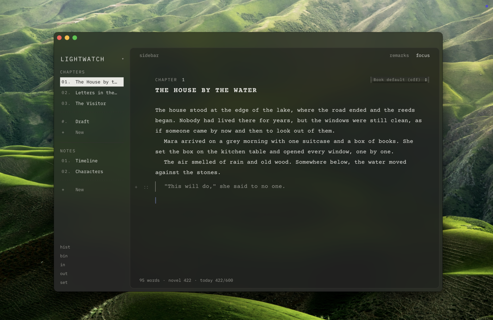

# ✒️ Inkwell

*A quiet place to write your novel — and articles too.*

Inkwell is a small, cozy writing app: rich text (not Markdown to stare at), chapters and notes in a sidebar, sticky-note-style remarks on any passage, spell-check in three languages, and a look that feels like a good typewriter, not a spreadsheet. It's built on open web technology with no proprietary tools — your writing is always just plain files in a folder you control.

## 📸 A look inside

**Remarks**, sitting quietly beside your text:



**Focus mode**, when you just want the page:



**A calm, translucent look**, at any width:



## ✨ Features

- 📖 **Chapters & notes** — numbered, drag-to-reorder, with a quiet divider for the ones you haven't placed yet
- 💬 **Remarks** — select any text and leave yourself a note beside it, like sticky comments in the margin
- 🎯 **Focus mode** — hides everything but the page (Ctrl/Cmd+Shift+F)
- ↔️ **Previous / next** — jump between chapters without leaving the keyboard
- 🔤 **Spell-check**, offline — English, Russian, and Ukrainian, red underlines, right-click suggestions and "Add to dictionary." Off by default; your call, per book or per chapter
- ⌨️ **No toolbar clutter** — select text for a small bubble menu, type `/` on an empty line for a block menu, hover the margin for drag handles
- ✍️ **Smart typography** — curly quotes (English, Ukrainian, German, guillemets, or off), em dashes and ellipses as you type
- 🎨 **Themes** — light, dark, or match your system, plus your own accent colour and text size
- 🪟 **Translucent window** (Mac) — the sidebar shows your desktop through it
- 🕰️ **History** — every text keeps its last 40 versions, browsable and restorable
- 🧮 **Word counts** — per chapter, for the whole book, and a daily writing goal
- 📤 **Markdown import & export** — bring files in, take your writing out, any time. No lock-in, ever
- 📚 **Multiple books**, switchable from one menu, like separate workspaces
- 🗑️ **Nothing disappears by accident** — deletes go to a Trash you can restore from

## 🧰 What you need (once)

Three free things, if you don't already have them:

1. **Xcode Command Line Tools** — open Terminal and run `xcode-select --install`
2. **Node.js** (the LTS version) — https://nodejs.org
3. **Rust** — run `curl --proto '=https' --tlsv1.2 -sSf https://sh.rustup.rs | sh`, then restart Terminal

## 🚀 How to run it

Inside this folder, run each of these on its own:

```
npm install
```

```
npm run app
```

The first run takes a few minutes (it's compiling). When it's done, Finder opens to `Inkwell.app` — drag it into Applications, then open it from Launchpad or Spotlight from now on.

Want to preview changes fast without a full rebuild? Run `npm run dev`, then open http://localhost:1420 in Chrome or Edge.

## 📁 How your writing is stored

The first time you open Inkwell, you choose a folder for your **library** — for example, one inside your Nextcloud sync folder. Every book is just a folder inside it:

```
MyLibrary/
  salt-and-signal/                 one book = one folder
    project.json                   title, order and numbers of chapters and notes
    chapters/<id>.html             one plain HTML file per chapter — opens in any browser
    chapters/<id>.remarks.json     the remarks written on that chapter
    notes/<id>.html                loose notes, same format
    _history/<id>/<time>.html      automatic snapshots (newest 40 per text)
    _trash/...                     deleted chapters/notes; nothing is erased
  harbour-notes/                   another book, same layout
  _trash_books/                    deleted books wait here; nothing is erased
```

No hidden index file, no database — just a folder Inkwell reads. That means it syncs cleanly with Nextcloud, Dropbox, iCloud, or anything else that syncs folders, and two devices editing different chapters at once never conflict.

## 🧭 Code map

- `src/main.ts` — the user interface
- `src/blocks.ts` — selection bar, `/` menu, line handles and block drag
- `src/sortable.ts` — drag to reorder sidebar lists, or move a row into the other list
- `src/mac.ts` — the translucent window on macOS
- `src/fonts.ts` — the bundled fonts
- `src/library.ts` — the folder of books
- `src/project.ts` — how one book is laid out on disk
- `src/fs.ts` — talks to the disk (Tauri, browser folder access, or browser storage)
- `src/remark.ts` — the TipTap extension for remarks
- `src/spell.ts` / `src/spellcheck.ts` — the offline spell-checker
- `src/export.ts` / `src/markdown.ts` — Markdown export and import
- `src-tauri/` — the small desktop shell (Rust)

## 🌱 Not yet (ideas for later)

- Attaching files, and linking to other chapters/notes by typing `@`
- Endless scroll from one chapter into the next, with a compact navigator
- Find and replace, typewriter scrolling
- Export to Word / PDF / EPUB
- A phone version

---

*Built with [TipTap](https://tiptap.dev) and [Tauri](https://tauri.app) — both open source, no proprietary tools anywhere in the stack.*
